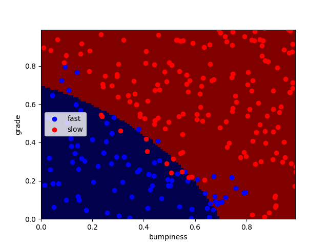

# GaussianNB Deployment on Terrain Data

A machine learning project that uses the Gaussian Naive Bayes classifier to classify terrain data. The goal is to distinguish between two classes of terrain (fast and slow) based on gradient and bumpiness features.

## Project Structure

```
├── ClassifyNB.py          # Contains the classifier function using GaussianNB
├── class_vis.py           # Visualization utilities for decision boundaries
├── prep_terrain_data.py   # Data generation and preprocessing
├── studentMain.py         # Main script to train and visualize the classifier
├── requirements.txt       # Python dependencies
├── test.png               # Visualization of decision boundary
└── README.md              # Project documentation
```

## Installation

1. **Clone the Repository:**

   ```bash
   git clone https://github.com/AgentZoil/GaussianNB-Deployment-on-Terrain-Data.git
   cd GaussianNB-Deployment-on-Terrain-Data
   ```

2. **Install Dependencies:**

   ```bash
   pip install -r requirements.txt
   ```

3. **Run the Project:**

   ```bash
   python studentMain.py
   ```

## Project Outcome

- Successfully classified terrain data into "fast" and "slow" categories using Gaussian Naive Bayes.
- Visualized the decision boundary between the two classes.

## Results

### Prediction Output

```
[0. 1. 0. 1. 1. 1. 1. 0. 1. 0. 1. 1. 0. 0. 1. 0. 0. 1. 1. 1. 1. 1. 1. 0.
 1. 1. 0. 1. 1. 0. 1. 1. 1. 1. 0. 1. 1. 1. 1. 0. 1. 0. 1. 0. 1. 0. 0. 0.
 1. 0. 1. 1. 0. 1. 1. 0. 0. 1. 1. 1. 1. 0. 0. 1. 1. 1. 1. 0. 0. 1. 0. 1.
 1. 0. 1. 1. 1. 1. 1. 0. 1. 0. 1. 1. 0. 0. 1. 1. 0. 0. 1. 0. 1. 0. 0. 1.
 ...
```

### Decision Boundary Visualization



## Technologies Used

- Python 3
- scikit-learn
- matplotlib
- NumPy

##

